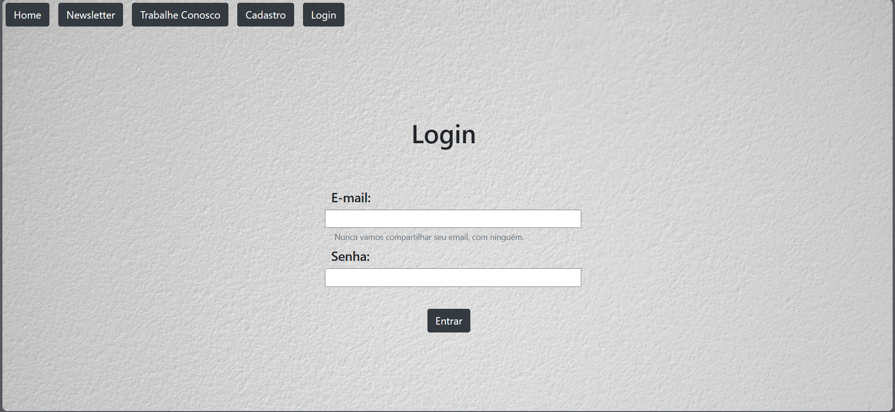

# portalNoticias-PHP
um projeto de PHP com CSS, estilo, sistema de cadastro e login protegido, com área do administrador, banco de dados, área do colunista, newsletter e trabalhe conosco.
  

  <h3>Página inicial com as notícias sendo pegas com um código de SQL</h3>
  

  

  <h3>Página de cadastro</h3>
  

  

  <h3>Página de login</h3>
  

  

  <h3>Página inicial, mas agora o administrador tá logado</h3>
  

  

  <h3>Página da Newsletter. Aqui você cadastra nome e e-mail e isso vai para o banco de dados</h3>
  

  

  <h3>Página do trabalhe conosco. Tem um sistema aqui de upload que você pode mandar o currículo em jpg, jpeg, png, pdf ou docx</h3>
  

  

  <h3>Página do Colunista. Apenas colunistas e administradores podem acessar. Aqui eles podem postar uma notícia e o sistema vai cadastrar tudo no banco de dados e criar uma página nova php para postar a notícia. Além disso, dá pra fazer o upload da imagem da notícia.</h3>
  

  

  <h3>Área do Admnistrador</h3>
  

  

  <h3>Página para ver os cadastrados</h3>
  

  

  <h3>Página que apareceria os novos cadastrados</h3>
  

  

  <h3>Página que apareceria as notícias novas para serem aprovadas</h3>
  

  

  <h3>Página de uma das notícias. (texto e imagem gerados por IA)</h3>
  

  

  <h3>Outra notícia. (texto e imagem gerados por IA)</h3>
  

  

  <h3>Página inicial, mas com uma pessoa normal logada</h3>
  

